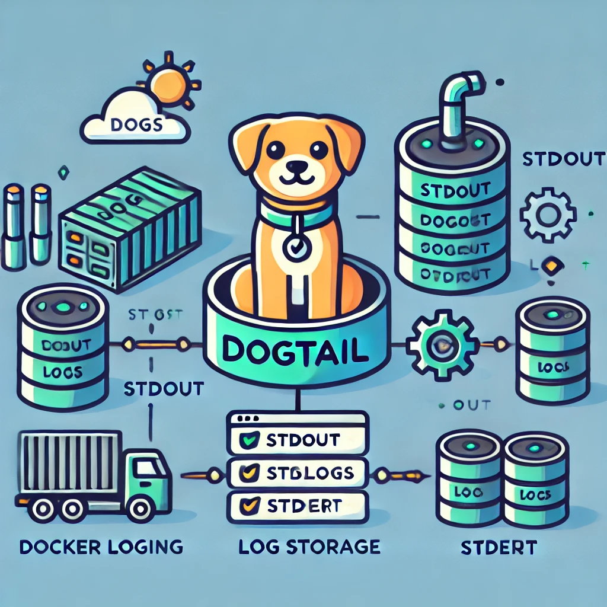
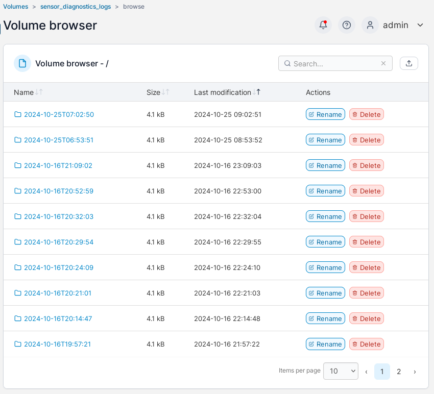
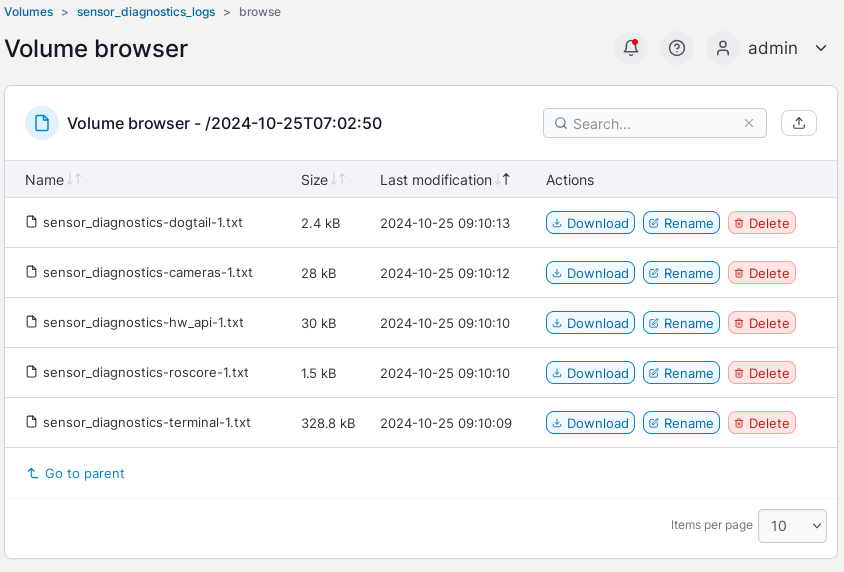

# DoGTail (Simple Plaintext Docker Logger)



**DoGTail** (**Docker Go Tail**) is a lightweight, zero-configuration logging sidecar Docker Compose.
It automatically *tails* the *stdout* and *stderr* streams from all containers in a Compose session, storing them in organized, plaintext log files for easy access.

## Features

* **Autonomous Logging**: Starts tailing logs immediately with no setup.
* **Plaintext Storage**: Logs are saved as plain text files in timestamped folders.
* **Zero Configuration**: No need for custom settings or complex setups.

## Quick Start

To integrate **DoGTail** into your Docker Compose setup, simply add the following service to your `docker-compose.yml` file:

```yaml
services:

  dogtail:
    image: klaxalk/dogtail:latest
    volumes:
      - /var/run/docker.sock:/var/run/docker.sock
      - ./logs:/etc/logs
```

## Volume Configuration

Ensure that you mount a local folder for the logs to `/etc/logs` within the *DoGTail* container.
This location will store the logs generated by all running containers.
Example

In your `docker-compose.yml` file:

```yaml
services:

  myapp:
    image: your-image
    # your app configuration here

  dogtail:
    image: klaxalk/dogtail:latest
    volumes:
      - /var/run/docker.sock:/var/run/docker.sock
      - ./logs:/etc/logs
```

or using a shared volume:

```yaml
volumes:

  logs:

services:

  myapp:
    image: your-image
    # your app configuration here

  dogtail:
    image: klaxalk/dogtail:latest
    volumes:
      - /var/run/docker.sock:/var/run/docker.sock
      - logs:/etc/logs:consistent
```

## How It Works

Once *DoGTail* starts, it immediately begins tailing the stdout and stderr outputs of all containers.
Logs are stored in plain text files under `/etc/logs` inside a new folder named by the current date and time (in ISO 8601 format).
This makes tracking and organizing logs simple and intuitive.

## DoGTail: Docker Go Tail

* *Do*cker *G*o *Tail* starts autonomously and captures logs as soon as Docker Compose is running.
* No extra configuration required—just set it up, and *DoGTail* handles the rest.

This project is licensed under the MIT License.

## Location of the logs

The logs can be found in the provided folder:


Each folder contains separate files for the containers within the compose session:

